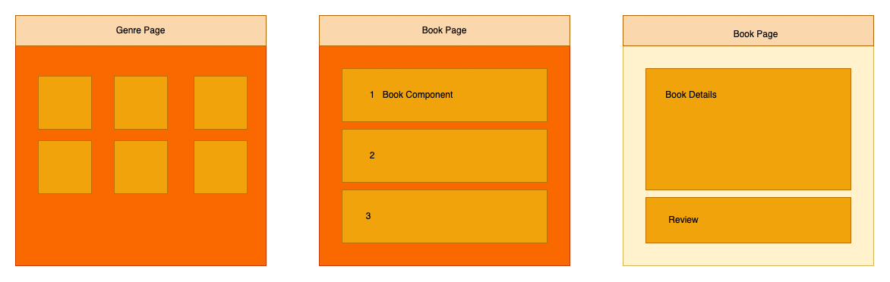

# Book Club

#### Date: 3/27/2022

### By: Molly Obermeier

#### [Website](https://obermeiermol.myportfolio.com/) | [GitHub](https://github.com/Tamollyo) | [LinkedIn](https://www.linkedin.com/in/marie-obermeier-6b6b03158/)

---

### **_Description_**

[Trello](https://trello.com/b/yADplCP5/book-club) | [GitHub Repo](https://github.com/Tamollyo/BookClub)

#### A book club for avid readers. Add your favorite books by genre and keep yourself up to date!

---

### **_Technologies Used_**

- Javascript
- React
- CSS

---

### **_Getting Started_**

##### Time to create and keep track of your library.

##### Pick your favorite genre.

##### Add, create, update or delete a book.

##### The project itself was deployed and can be viewed [here](URL).

---

### **_Planning_**

##### ERD

##### FLOW

##### Wireframes

### **_Future Updates_**

- Anything in light yellow will be past MVP and possibly a future update!
- Login and save functionality
- Update CSS
- Add review section
- rework sorting or have options in how to sort.

---

### **_Credits_**

##### Images: [DuckDuckGo Search](http://www.duckduckgo.com)

##### Book Descriptions: [GoodReads](https://www.goodreads.com/)

##### Genre List: [Wikipedia](https://en.wikipedia.org/wiki/List_of_genres)

##### Research: [W3 Schools](https://www.w3schools.com/)

##### Research: [MDN](https://developer.mozilla.org/en-US/docs/Web/JavaScript/Reference/Global_Objects/Array/forEach)

##### Research: [Class Labs]('')

---
